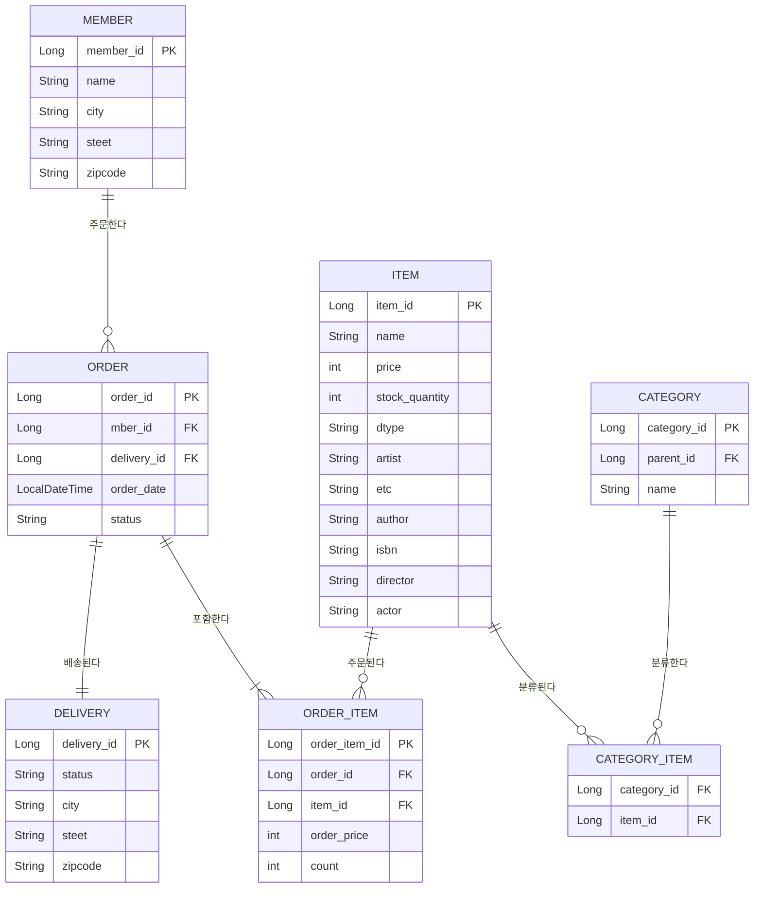

## 요구사항 분석
- 회원은 상품을 주문할 수 있다.
- 주문 시 여러 종류의 상품을 구매할 수 있다.

### 기능 목록
- 회원기능
  - 회원등록
  - 회원조회
- 상품기능
  - 상품등록
  - 상품수정
  - 상품조회
- 주문기능
  - 상품주문
  - 주문내역 조회
  - 주문취소

## 도메인 모델 분석
- 회원-주문: 일대다
- 주문-상품: 다대다

### ERD

> 예제를 단순화하기 위해 다음 기능은 구현하지 않는다.
> - 로그인과 권한 관리 X
> - 파라미터 검증과 예외 처리 단순화
> - 상품은 도서관만 사용
> - 카테고리는 사용X
> - 배송 정보는 사용X

### 계층형 구조 사용
- controller: 웹 계층
- service: 비즈니스 로직, 트랜잭션 처리
- repository: JPA를 직접 사용하는 계층, 엔티티 매니저 사용
- domain: 엔티티가 모여 있는 계층

#### 패키지 구조
- domain
- exception
- repository
- service
- web
