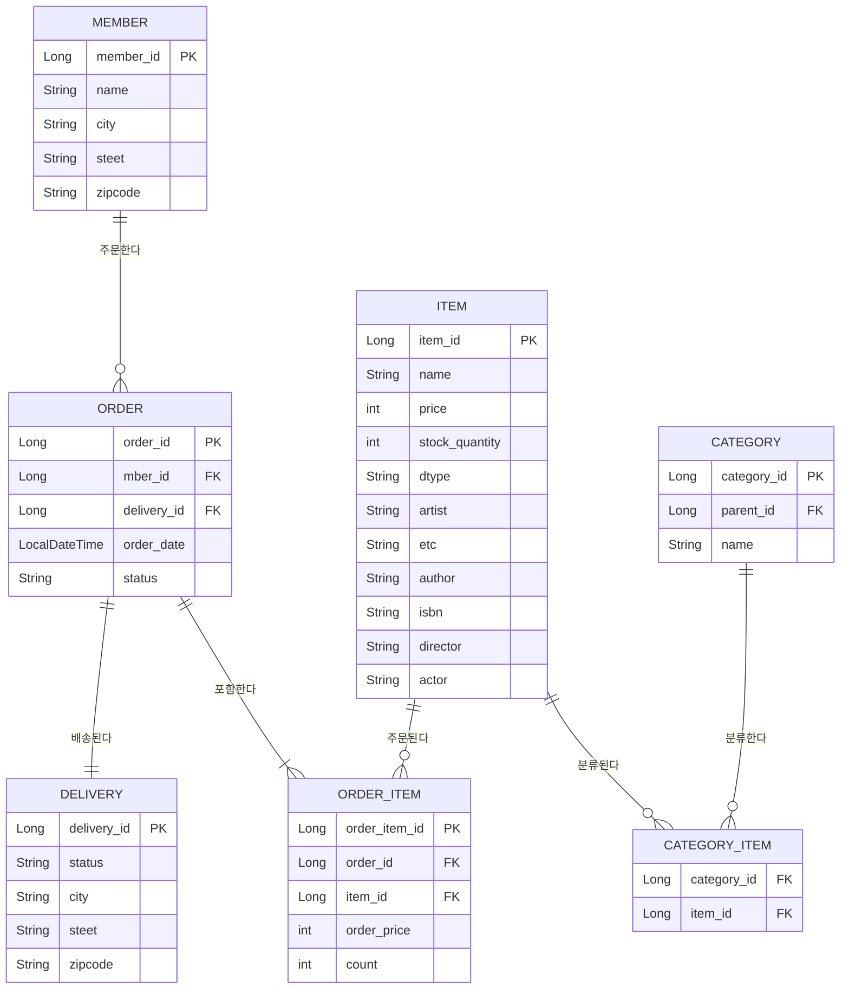

## 요구사항 분석
- 회원은 상품을 주문할 수 있다.
- 주문 시 여러 종류의 상품을 구매할 수 있다.

### 기능 목록
- 회원기능
  - 회원등록
  - 회원조회
- 상품기능
  - 상품등록
  - 상품수정
  - 상품조회
- 주문기능
  - 상품주문
  - 주문내역 조회
  - 주문취소

## 도메인 모델 분석
- 회원-주문: 일대다
- 주문-상품: 다대다

### ERD

